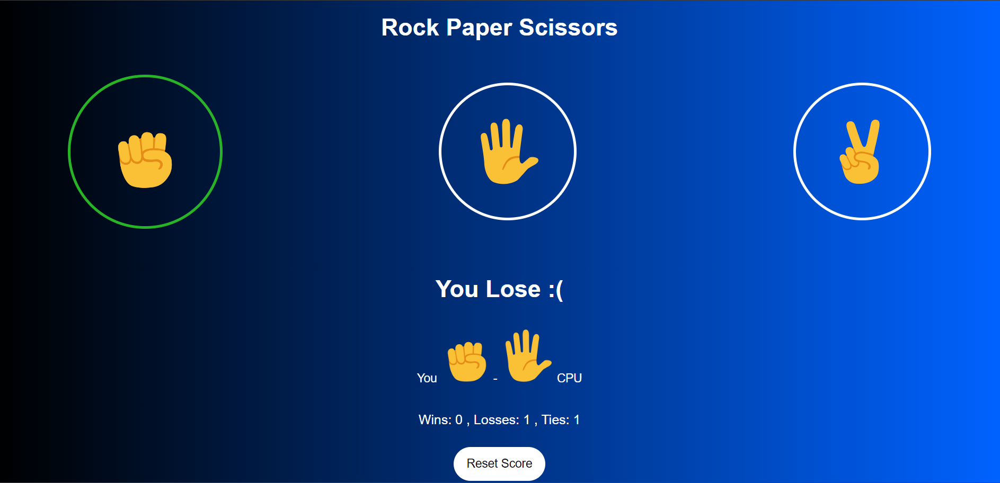

# Rock Paper Scissors Game 🎮



Welcome to the Rock Paper Scissors Game! This is a simple web-based game where you can play Rock-Paper-Scissors against the computer.

## Features ✨
- Play Rock-Paper-Scissors against the computer.
- Track your score (Wins, Losses, Ties).
- Reset score functionality.
- Simple and intuitive UI.
- Responsive design.

## Installation 🛠️
To run this game locally, follow these steps:

1. Clone the repository:
    ```bash
    git clone https://github.com/LuthoYRN/rock-paper-scissors.git
    ```
2. Navigate to the project directory:
    ```bash
    cd rock-paper-scissors
    ```
3. Open `rps.html` in your favorite browser to start the game.

## Usage 📖
1. Choose your move by clicking on Rock, Paper, or Scissors.
2. The computer will randomly select its move.
3. The result of the game (Win, Lose, Tie) will be displayed.
4. The score will be updated accordingly.
5. Click the "Reset Score" button to reset the game score.

## Technologies 🛠️
- HTML
- CSS
- JavaScript

Happy playing! 🎉